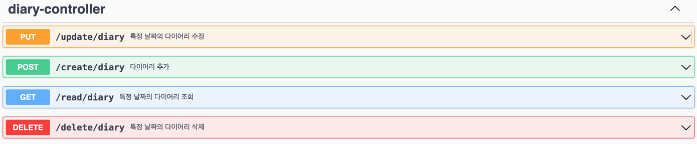

# 날씨 일기 작성 API [2024.01.03 ~ 2024.01.27]

## Development Environment

- Intellij IDEA Ultimate
- Java 17
- Gradle 7.4.1
- Spring Boot 2.7.18
- [openweathermap](https://openweathermap.org/)

## API

- POST / create / diary
  - 외부 API 에서 받아온 날씨 데이터와 함께 DB에 저장

- GET / read / diary
  - 특정 날짜의 일기를 List 형태로 반환

- GET / read / diaries
  - 특정 기간 내의 일기를 List 형태로 반환.

- PUT / update / diary
  - 특정 날짜의 첫번째 일기 글을 새로 받아온 일기글로 수정

- DELETE / delete / diary
  - 특정 날짜의 모든 일기를 삭제

## API Documentation

